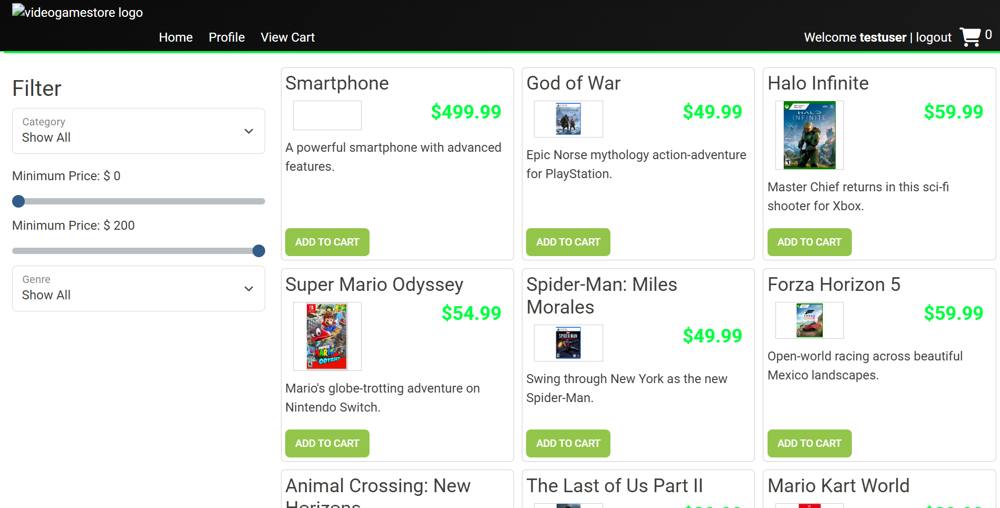
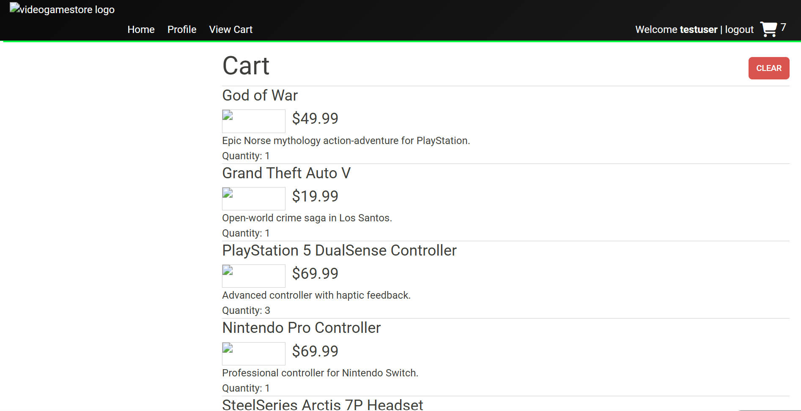
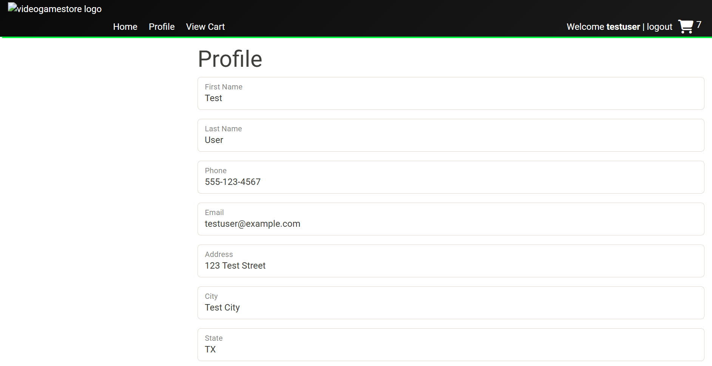
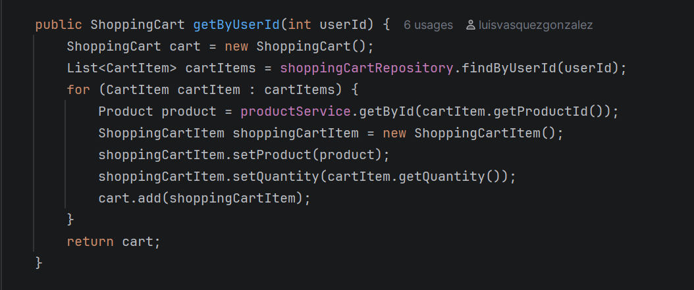

# Capstone 3 — Video Game Store

## Overview

This project is a Spring Boot backend API for a Video Game Store web application. The application supports product browsing, category management, user authentication, shopping cart persistence, and user profile management. The backend connects to a MySQL database and is designed to support the provided Video Game Store frontend.

The main goal of this capstone was to work as a backend developer on an existing e-commerce application by fixing product-related bugs, implementing missing controller/service logic, and adding new API features using a layered Spring Boot architecture.

## Project Features

### Authentication

- Register a new user account.
- Log in with existing credentials.
- Receive and use JWT token to access protected API endpoints after login.

### Product API

- View all products.
- View a product by ID.
- Search and filter products by:
  - Category
  - Minimum price
  - Maximum price
  - Subcategory
  - Featured status
- Admin users can create, update, and delete products.

### Category API

- View all categories.
- View a category by ID.
- View products by category.
- Admin users can create, update, and delete categories.

### Shopping Cart API

- Logged-in users can view and add products their shopping cart.
- Logged-in users can update the quantity of an existing cart item.
- Logged-in users can clear all items from their cart.
- Cart items are saved in the database, so the cart persists after logout.

### User Profile API

- Logged-in users can view their profile.
- Logged-in users can update profile fields such as name, phone, email, address, city, state, and zip.

## Authentication Endpoints

| Method | Endpoint | Access | Description |
|---|---|---|---|
| POST | `/register` | Public | Register a new user |
| POST | `/login` | Public | Log in and receive JWT token |

## Product Endpoints

| Method | Endpoint | Access | Description |
|---|---|---|---|
| GET | `/products` | Public | Get all products or search/filter products |
| GET | `/products/{id}` | Public | Get one product by ID |
| POST | `/products` | Admin | Create a product |
| PUT | `/products/{id}` | Admin | Update a product |
| DELETE | `/products/{id}` | Admin | Delete a product |

## Category Endpoints

| Method | Endpoint | Access | Description |
|---|---|---|---|
| GET | `/categories` | Public | Get all categories |
| GET | `/categories/{id}` | Public | Get one category by ID |
| GET | `/categories/{id}/products` | Public | Get all products in a category |
| POST | `/categories` | Admin | Create a category |
| PUT | `/categories/{id}` | Admin | Update a category |
| DELETE | `/categories/{id}` | Admin | Delete a category |

## Shopping Cart Endpoints

Shopping cart endpoints require a logged-in user with the `ROLE_USER` role.

| Method | Endpoint | Access | Description |
|---|---|---|---|
| GET | `/cart` | User | Get current user's shopping cart |
| POST | `/cart/products/{productId}` | User | Add product to cart |
| PUT | `/cart/products/{productId}` | User | Update quantity for an existing cart item |
| DELETE | `/cart` | User | Clear current user's cart |

## Profile Endpoints

Profile endpoints require a logged-in user with the `ROLE_USER` role.

| Method | Endpoint | Access | Description |
|---|---|---|---|
| GET | `/profile` | User | Get current user's profile |
| PUT | `/profile` | User | Update current user's profile |

## Interesting Code Highlight

One important feature I implemented was the shopping cart service logic. The shopping cart table stores only the `userId`, `productId`, and `quantity`, but the API response needs full product details. To solve this, the service loads the user's cart rows, finds each product, creates a `ShoppingCartItem`, and adds it to the final `ShoppingCart` response.

This keeps the database design simple while still returning a complete cart response to the frontend.

## Future Improvements

- Add checkout functionality that converts a shopping cart into an order.
- Add order history for users.
- Improve cart validation for invalid or negative quantities.
- Add more unit and integration tests for controllers and services.
- Improve frontend styling and error messages.
- Add admin dashboard functionality.

## Author

Luis V.G.

Capstone 3 — E-Commerce API and Site
